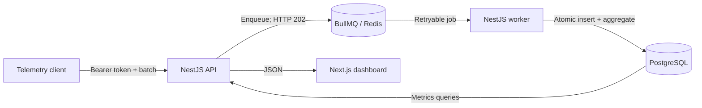

# Rate Snoop

Rate Snoop is a near-real-time observability pipeline for API traffic. It accepts request telemetry asynchronously and presents request volume, error rate, HTTP 429, latency, and top-endpoint metrics in a Next.js dashboard.

The project is deliberately compact, but its critical path exercises real distributed-systems concerns: asynchronous acceptance, at-least-once delivery, idempotency, transactional aggregation, backpressure, dependency readiness, and eventual consistency.

## Architecture



The API does **not** persist accepted events. It validates and enqueues them. The worker owns persistence and minute-level aggregation, so `202 Accepted` means the batch reached Redis—not that it is already visible in PostgreSQL or the dashboard.

See [Design notes](docs/design-notes.md) for invariants, delivery semantics, failure analysis, and scaling trade-offs.

## What is implemented

- Bearer ingest tokens stored as SHA-256 hashes.
- Batch validation for 1–500 events.
- BullMQ jobs with three attempts and exponential backoff.
- Backlog-based admission control at 10,000 pending jobs.
- PostgreSQL raw-event storage and minute aggregates.
- Transactional raw insertion plus aggregate upsert.
- Concurrency-safe deduplication for events carrying `eventId`.
- Endpoint normalization for ID-like path segments.
- Request-weighted latency and error-rate calculations.
- Separate liveness and dependency-aware readiness probes.
- Docker Compose development and complete-stack configurations.
- CI for lint, type-check, tests, builds, container builds, and smoke checks.

## Technology

| Layer | Technology | Responsibility |
|---|---|---|
| Dashboard | Next.js 14, React Query, Recharts | Project management and metrics visualization |
| API | NestJS, class-validator | Authentication, validation, enqueueing, metrics reads |
| Queue | BullMQ 5, Redis | Buffering, retries, distributed job delivery |
| Worker | NestJS, BullMQ WorkerHost | Raw persistence and minute aggregation |
| Database | PostgreSQL, Drizzle ORM | Projects, token hashes, events, aggregates |
| Tooling | pnpm, Turborepo, Docker Compose, Vitest | Workspace orchestration and verification |

## Quick start

### Prerequisites

- Node.js 20+
- pnpm 9
- Docker with Docker Compose

### Development mode

```bash
git clone https://github.com/Pnathan2544/snoop_rogg.git
cd snoop_rogg
cp .env.example .env
pnpm install
pnpm infra:up
pnpm dev
```

The development stack exposes:

| Service | Address |
|---|---|
| Dashboard | <http://localhost:3000> |
| API | <http://localhost:3001> |
| Worker probes | <http://localhost:3002/health> |
| PostgreSQL | `localhost:5434` |
| Redis | `localhost:6379` |

For a new PostgreSQL volume, the initial schema is applied automatically from `packages/db/drizzle/0000_initial_schema.sql`.

Stop the development infrastructure with:

```bash
pnpm infra:down
```

### Complete Docker stack

```bash
pnpm stack:up
```

This builds and starts PostgreSQL, Redis, the API, worker, and dashboard. The web service waits for the API readiness probe before starting.

```bash
pnpm stack:down
```

## Generate demo traffic

With the applications running:

```bash
pnpm --filter @rate-snoop/api seed
```

The seed script creates a project and token, then sends a batch every second for 60 seconds. Configuration can be overridden:

```bash
DURATION=15 BATCH_SIZE=10 pnpm --filter @rate-snoop/api seed
PROJECT_ID=<uuid> TOKEN=<token> pnpm --filter @rate-snoop/api seed
```

On PowerShell:

```powershell
$env:DURATION = "15"
$env:BATCH_SIZE = "10"
pnpm --filter @rate-snoop/api seed
```

Open the generated project in the dashboard. Data becomes visible after the worker processes the job and the dashboard performs its next 30-second poll.

## Manual ingestion

Create a project:

```bash
curl -X POST http://localhost:3001/projects \
  -H "Content-Type: application/json" \
  -d '{"name":"Demo"}'
```

Create an ingest token using the returned project ID:

```bash
curl -X POST http://localhost:3001/projects/<project-id>/tokens \
  -H "Content-Type: application/json" \
  -d '{"name":"Local client"}'
```

Submit telemetry using the raw token returned at creation:

```bash
curl -X POST http://localhost:3001/ingest/events \
  -H "Authorization: Bearer <token>" \
  -H "Content-Type: application/json" \
  -d '{
    "events": [{
      "eventId": "demo-event-001",
      "provider": "openai",
      "endpoint": "/v1/chat/completions",
      "method": "POST",
      "statusCode": 200,
      "latencyMs": 450,
      "ts": "2026-07-12T09:41:27.123Z"
    }]
  }'
```

`eventId` is optional at validation time but strongly recommended: it is the idempotency key that prevents duplicate delivery from inflating metrics.

## API surface

| Method | Path | Authentication | Purpose |
|---|---|---|---|
| `GET` | `/health` | None | Backward-compatible liveness response |
| `GET` | `/health/live` | None | Process liveness |
| `GET` | `/health/ready` | None | PostgreSQL and Redis readiness |
| `GET` | `/projects` | None | List projects |
| `POST` | `/projects` | None | Create a project |
| `GET` | `/projects/:id` | None | Read a project |
| `GET` | `/projects/:id/tokens` | None | List token metadata |
| `POST` | `/projects/:id/tokens` | None | Create an ingest token |
| `POST` | `/ingest/events` | Bearer token | Validate and enqueue 1–500 events |
| `GET` | `/ingest/queue-stats` | Bearer token | Read BullMQ job counts |
| `GET` | `/metrics/volume` | None | Request counts by minute and endpoint |
| `GET` | `/metrics/errors` | None | Errors, 429s, and error rates |
| `GET` | `/metrics/latency` | None | Weighted-latency inputs |
| `GET` | `/metrics/top-endpoints` | None | Top 20 endpoints for a time range |

Metrics routes require `projectId`, ISO-8601 `from`, and ISO-8601 `to`. Reversed time ranges are rejected. `provider` is optional.

Project management and metrics reads are intentionally unauthenticated in this local demonstration. Do not expose the API publicly without user authentication and project-level authorization.

## Event contract

```json
{
  "eventId": "provider-request-id",
  "provider": "openai",
  "endpoint": "/v1/chat/completions",
  "method": "POST",
  "statusCode": 200,
  "latencyMs": 450,
  "ts": "2026-07-12T09:41:27.123Z",
  "rateLimitRemaining": 987
}
```

| Field | Validation |
|---|---|
| `eventId` | Optional string; recommended for retry safety |
| `provider` | Non-empty string |
| `endpoint` | Non-empty string |
| `method` | Non-empty string |
| `statusCode` | Integer from 100 through 599 |
| `latencyMs` | Non-negative integer |
| `ts` | ISO-8601 timestamp |
| `rateLimitRemaining` | Optional non-negative integer |

## Verification

Run the same quality gates used before container smoke tests:

```bash
pnpm verify
```

Or run them independently:

```bash
pnpm lint
pnpm type-check
pnpm test
pnpm build
```

## Repository structure

```text
apps/
  api/       NestJS ingestion, project, token, metrics, and probe endpoints
  worker/    BullMQ consumer and transactional aggregation
  web/       Next.js dashboard
packages/
  db/        Drizzle schema, SQL migration, and database client
  types/     Shared wire contracts
docs/
  design-notes.md
```

## Current boundaries

- No end-user authentication or project-level authorization.
- No separate dead-letter queue or automated failed-job replay policy.
- Backpressure is an approximate admission check, not an atomic distributed quota.
- Events without `eventId` are not idempotent under redelivery.
- No retention, partitioning, reconciliation, or long-term capacity policy.
- Production Redis durability, TLS, secrets, and deployment manifests are out of scope.

These limitations are explicit because reliability claims are only useful when their boundary conditions are visible.
